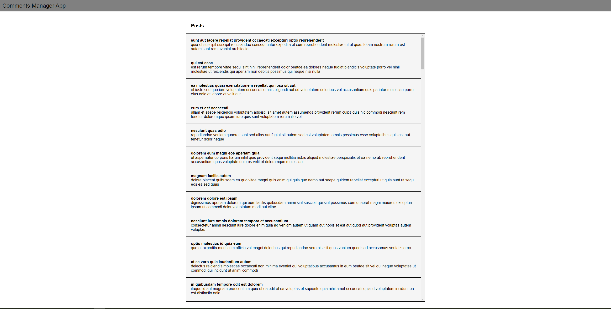
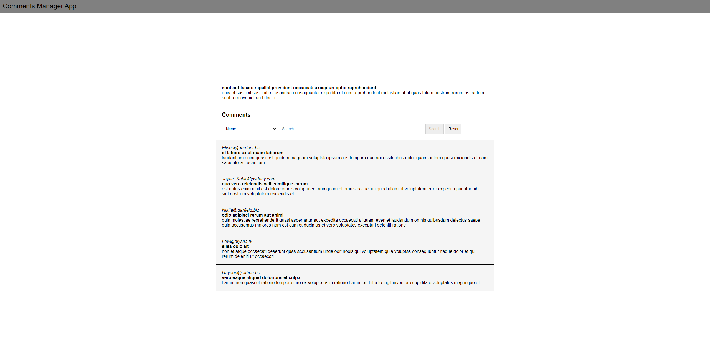
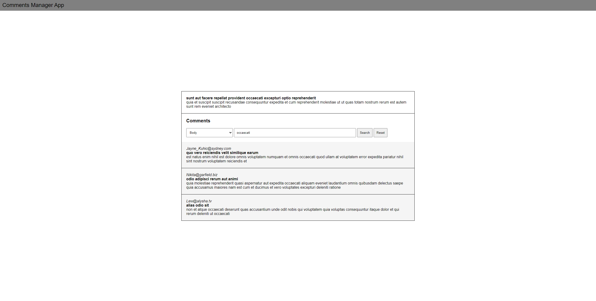

## Build a comments manager app

1. Create a screen to display all the posts

   - View all posts endpoint: https://jsonplaceholder.typicode.com/posts

2. Create a second screen that shows all the comments related to a post

   - View individual post endpoint: https://jsonplaceholder.typicode.com/posts/{post_id}
   - View comments for a post endpoint: https://jsonplaceholder.typicode.com/comments?postId=1

3. Add a search box that allows the user to filter the comments related to a post. The user should be able to filter the results based on the:
   - name
   - email
   - body

## Notes

- Once completed, send us a screenshot of all screens
- Make your repo public, and send us the link for us to review

## Screenshots

1. A screen to display all the posts

2. A second screen that shows all the comments related to a post

3. A search box that allows the user to filter the comments related to a post
